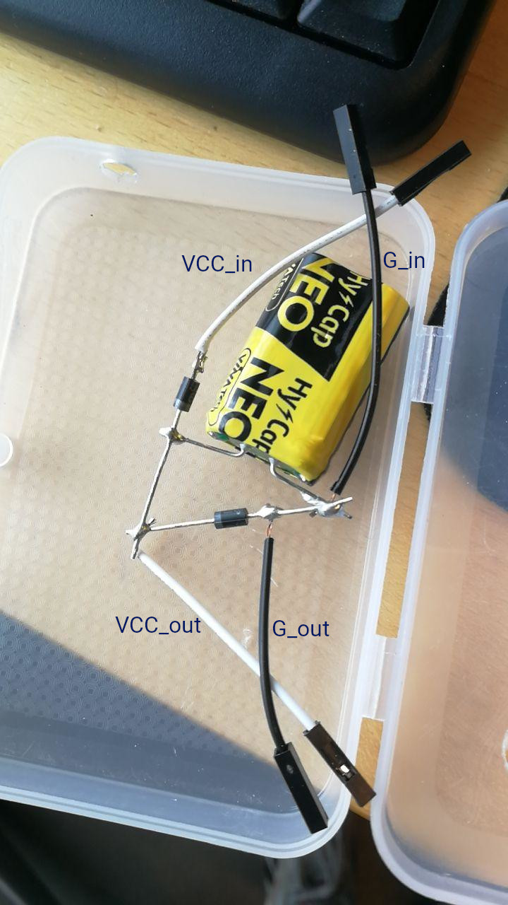

# Wemos D1-based HAN-module for Kamstrup Omnipower smart meter

__This will probably only work for Radius customers in the greater Copenhagen area__

Here's what we do:
- Connect to Wi-Fi and MQTT, 
- Read the output of Kamstrup Omnipower HAN-slot with a Wemos D1 Mini (ESP8266-based MCU), 
- Decrypt the incoming data using the two keys you got from Radius (Copenhagen-area DSO), 
- Publish the data to a MQTT broker of your choice.

__Note: You need to write to [kundesupport@radiuselnet.dk](mailto:kundesupport@radiuselnet.dk) to get your decryption keys__

### Hookup guide:

1. Rename `secrets.h.TEMPLATE` to `secrets.h` and insert your WiFi, MQTT, and Key information
2. Upload sketch to Wemos
2. Connect pin: Wemos `G` pin <-> Kamstrup HAN slot top left pin
2. Connect pin: Wemos `D5` pin <-> Kamstrup HAN slot top middle pin
3. Power the Wemos through USB charger
4. Subscribe to your MQTT broker and do what ever you want with it

#### If you're using the super-cap buffer

Sorry in advance for the soldering gore.
The power output of the omnipower is throttled to 75mA, which is not enough to scan or send over wifi. But we can use a super cap buffer to accumulate enough power between each send. 

_I'll add instructuions on how to build the simple super cap buffer at some point. It's a 5F cap and a couple of schottky diodes._

__Hookup:__

1. Connect: Buffer `VCC_in` <-> Kamstrup HAN slot bottom left pin
2. Connect: Buffer `G_in` <-> Kamstrup HAN slot top left pin
3. Connect: Buffer `VCC_out` <-> Wemos `5V` pin
4. Connect: Buffer `G_out` <-> Wemos `G` pin
5. Connect: Kamstrup HAN slot top middle pin to Wemos `D5` pin

----

### History:
Adapted from [Claustn](https://github.com/Claustn/esp8266-kamstrup-mqtt) to use SoftwareSerial instead of a second UART, to make it work with my Wemos D1 Mini.
Claustn adapted his code from [Asbjoern](https://github.com/Asbjoern/Kamstrup-Radius-Interface/) whose repo has many more features than this little thing.

